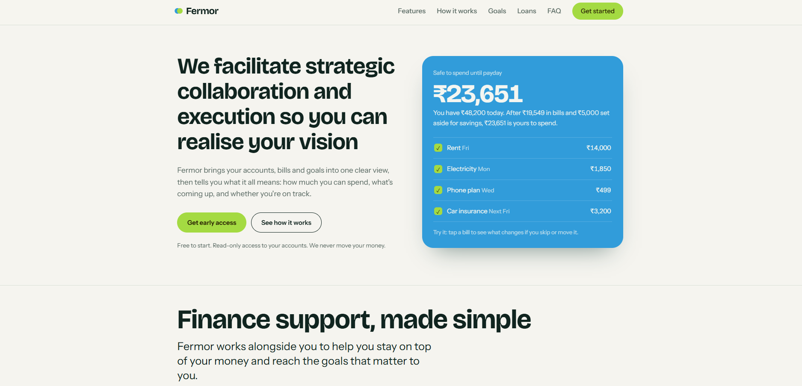
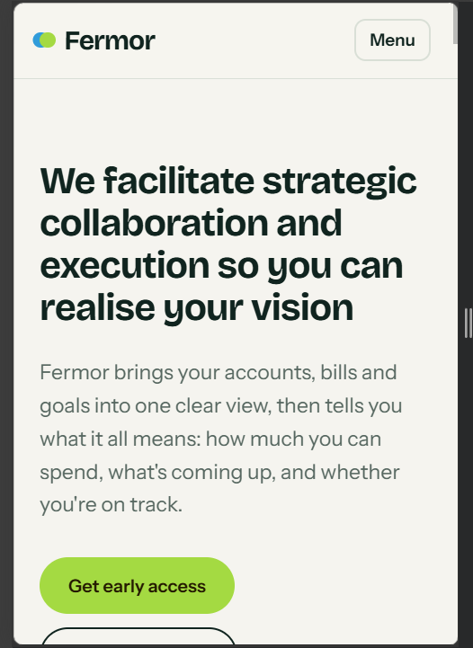

Fermor Homepage

A responsive, working homepage for Fermor, a finance platform that makes money simpler, clearer and easier to use. Built with plain HTML, CSS and JavaScript, with no build step.

## Screenshots

### Desktop

### Mobile

Approach

The page is for people who want to understand their money . The hero shows the product working: an interactive "Safe to spend" card that updates as you tap bills on or off. Below it are features, how it works, a goal calculator, loan offerings, audiences, an FAQ and an early-access signup.

Design: off-white background, light green and sky blue accents, Bricolage Grotesque and Instrument Sans, amounts in rupees (₹).

What works
Interactive "Safe to spend" card and savings goal calculator
Individual / Business loan switcher, audience tabs, FAQ accordion
Mobile menu and signup form with email validation
Responsive layout, keyboard support and reduced-motion support
Run it

Keep index.html, style.css and script.js in the same folder and open index.html in a browser.

Notes

Copy, figures and loan terms are placeholders. The signup form is front end only.
